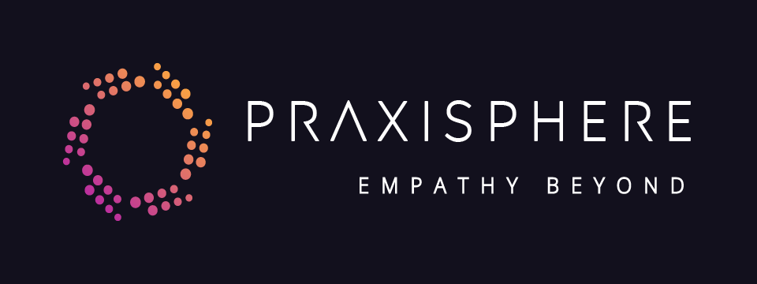

# Praxisphere

## Empowering Well-being Through Technology

Praxisphere is an innovative startup at the intersection of technology and well-being, dedicated to creating practical solutions that foster growth, connection, and transformation. Our name, a fusion of 'Praxis' and 'Sphere', embodies our commitment to action-oriented approaches within a supportive, holistic environment.

## Table of Contents

- [Vision & Mission](#vision--mission)
- [Core Values](#core-values)
- [Our Approach](#our-approach)
- [Target Audience](#target-audience)
- [Technology Stack](#technology-stack)
- [Getting Started](#getting-started)
- [Contributing](#contributing)
- [Code of Conduct](#code-of-conduct)
- [License](#license)

## Vision & Mission

**Vision**: To become the leading provider of technology that fosters inclusive and supportive communities, empowering individuals and organizations to thrive.

**Mission**: To create practical technology solutions that empower individuals, organizations, and communities to establish deeper connections, improve well-being, and prosper together.

## Core Values

- **Progressive**: We evolve, adapt, and continuously seek improvement.
- **Inclusive**: We create a diverse and respectful environment for everyone.
- **Virtuous**: We prioritize relationships and always strive to do the right thing.
- **Overt**: We embrace transparency and clear communication.
- **Thoughtful**: We respect each other's feelings and prioritize relationships.

## Our Approach

Praxisphere takes a holistic approach to well-being, encompassing physical, mental, emotional, and social aspects. We provide hands-on, practical solutions that empower our users to take action towards their well-being goals.

## Target Audience

We cater to a diverse range of clients, including:

- Corporate organizations (HR departments, corporate wellness programs)
- Employees (Young Professionals, Working Parents)
- Industries with high stress levels (IT, healthcare)
- Educational institutions
- Health and wellness enthusiasts
- Government and non-profit organizations

## Technology Stack

Our robust and modern tech stack ensures efficient, scalable, and secure solutions:

- **Frontend**: TypeScript, Next.js, Tailwind CSS
- **Backend**: Strapi CMS, PostgreSQL
- **Authentication**: Auth0
- **Email Service**: Resend

## Getting Started

To get started with the Praxisphere project, follow these steps:

1. Clone the repository:
git clone [https://github.com/your-username/praxisphere.git
](https://github.com/Praxisphere/praxis-ux.git)
2. Install dependencies:
cd praxisphere
npm install

3. Set up environment variables:
cp .env.example .env.local

Edit `.env.local` with your specific configuration.

4. Run the development server:
npm run dev

5. Open [http://localhost:3000](http://localhost:3000) in your browser to see the application.

## Contributing

We welcome contributions from the community! If you'd like to contribute to Praxisphere, please follow these steps:

1. Fork the repository
2. Create a new branch (`git checkout -b feature/AmazingFeature`)
3. Make your changes
4. Commit your changes (`git commit -m 'Add some AmazingFeature'`)
5. Push to the branch (`git push origin feature/AmazingFeature`)
6. Open a Pull Request

Please read our [CONTRIBUTING.md](CONTRIBUTING.md) for details on our code of conduct and the process for submitting pull requests.

## Code of Conduct

We are committed to fostering a welcoming and inclusive community. Please read our [Code of Conduct](CODE_OF_CONDUCT.md) to understand the behavior we expect from all contributors and participants.

## License

This project is licensed under the [MIT License](LICENSE.md).

---

Join us in our mission to foster deeper connections, improve well-being, and prosper together. Together, we can create a world where technology empowers individuals and organizations to achieve their well-being goals.

For more information, visit our [website](https://www.praxisphere.com) or contact us at info@praxisphere.com.
